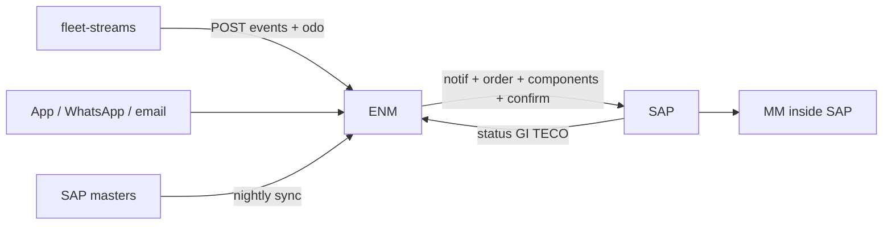

# ENM × SAP PM × fleet-streams — full integration

**Branch:** `sap-pm-enm-integration` (same name in both repos)
**Rebase onto:** `main` in ENM, `production` in fleet-streams
**Implement in:** `transvolt-enm`. fleet-streams POSTs into ENM; it never talks to SAP.
**Companion spec:** `fleet-streams` `docs/superpowers/specs/2026-08-24-enm-sap-pm-feed-design.md`

This is the spec to implement ENM end-to-end. Keep it small. Do not rebuild SAP, stores, or financials.

## Why

Transvolt SAP PM is live (go-live July 2026: FI, MM, SD, PM, QM). Equipment and other masters are in production. Ground staff cannot run IW21/IW31/IW41. ENM is the only capture screen. SAP remains the system of record for the maintenance **order** and for **material**, so MM can issue stock.

## Locked decisions

1. **Job card is born in ENM.** Every field a person fills is filled in ENM. SAP is downstream.
2. **If the job needs material, open a job card** and post the C-chain to SAP: notification → maintenance order (job card) → components → time/work confirmation → technical completion.
3. **Clean daily inspection, no material:** ENM only. Nothing posted to SAP.
4. **Operational reports stay in ENM** (DMR, inspections, investigations, control charts, bus history). Do not duplicate them in SAP.
5. **Material used must exist on the SAP order.** ENM names SAP materials and quantities. Goods issue, valuation, and FI stay inside SAP.
6. **SAP updates flow back** onto the same ENM card: order status, issued qty, TECO. SAP never creates a card.
7. **Daily two-way recon** is an exception list, not a third editor. Match ENM `job_card_id` ↔ SAP order number.
8. **fleet-streams never calls SAP.** Serving POSTs breakdowns and odometer into ENM.
9. **WhatsApp + email** are another client of the same ENM API. They are not a second system of record.



## Vocabulary

| Word | Meaning |
|---|---|
| ENM notification | In-app / FCM / WhatsApp / email to a person |
| SAP notification | PM notification on the equipment |
| Job card | ENM object, 1:1 with a SAP maintenance order |
| Streams breakdown | On-road incident (`breakdown_id`) |
| ENM breakdown | Depot register entry, may be seeded from streams |

## What to build (ENM)

### 1. Ingest from fleet-streams (replace the odometer stub)

Serving **POSTs into ENM**. Do not poll fleet-streams on a timer. Console SSE is the wrong bus (per-pod, browsers only).

New routes, bearer `ENM_FEED_TOKEN`, no session cookie:

- `POST /api/v1/integrations/fleet-streams/events` — open / update / clear a streams breakdown
- `POST /api/v1/integrations/fleet-streams/odometers` — batch odometer readings

On events:

- `open` → create or attach an ENM breakdown for that registration; store `streams_breakdown_id`
- `update` → patch the same ENM breakdown
- `clear` → resolve it if still open (do **not** TECO a job card automatically; a bus moving is not “parts issued”)
- Idempotency key: `streams_breakdown_id` (and `action`). A duplicate POST is a no-op.

On odometers: write with `record_reading`, source `fleet-streams`. Never move an odometer backwards. Unknown registration: skip the row, do not auto-create a vehicle.

If ENM was down, on startup call the streams **replay** GETs once (`/api/enm/v1/events?after=` and `/vehicles`) then go back to ingest. That is catch-up, not the live path.

Config: `ENM_FEED_TOKEN` (same secret serving uses). Serving holds `ENM_BASE_URL` pointing here.

**Event body** (`POST /api/v1/integrations/fleet-streams/events`):

```json
{
  "vehicle_id": "MH40LY1894",
  "action": "open",
  "breakdown_id": 1842,
  "category": "Tyre",
  "severity": "major",
  "note": "LHS rear",
  "contact": null,
  "by_whom": "ops",
  "eta_min": 40,
  "lat": 19.18,
  "lon": 72.85,
  "ts": "2026-08-24T15:40:00Z",
  "odo_km": 41230
}
```

`action` is `open` | `update` | `clear`. Map `vehicle_id` to `vehicles.registration_no` (uppercase, no whitespace).

**Odometer body** (`POST /api/v1/integrations/fleet-streams/odometers`):

```json
{ "readings": [{ "vehicle_id": "MH40LY1894", "odo_km": 41230, "odo_ts": "2026-08-24T16:01:00Z" }] }
```

**Replay** (only if ENM was down), bearer same token, against fleet-streams serving:

- `GET {FLEET_STREAMS_URL}/api/enm/v1/events?after={last_event_id}`
- `GET {FLEET_STREAMS_URL}/api/enm/v1/vehicles`

`TelematicsProvider.fetch` is unused for the live path.

### 2. SAP master sync (read-only)

Nightly job, plus a manager “Sync now” button. Pull into ENM tables, never push masters to SAP.

| SAP | ENM table |
|---|---|
| Equipment | `vehicles.sap_equipment_no` (match registration) |
| Functional location | `sites.sap_floc` |
| Notification types / order types / work centers / activity types | small lookup tables |
| Catalog codes (damage / cause / activity) | map onto `defect_types` where a GROUP already exists; extra codes stay as catalog rows |
| Material master (spares the depot may use) | `sap_materials` |
| Task lists for docking/PM | store task-list group + operations on the work type |

A vehicle with no equipment number cannot open a job card. Show that on the fleet screen.

Adapter: one module `app/services/sap/client.py` with a narrow interface (`get_equipment`, `create_notification`, `create_order`, `add_components`, `confirm`, `teco`, `read_order`). First connector is whatever BASIS gives (RFC/BAPI or S/4 OData). Flutter never calls SAP.

### 3. Job card

New table `job_cards`:

- `id`, `site_code`, `bus_id`, `source` (`inspection` \| `entry` \| `breakdown`)
- `source_id`, `streams_breakdown_id` (nullable)
- `sap_notification_no`, `sap_order_no` (nullable until posted)
- `status`: `draft` → `posted` → `issued` / `teco` / `error`
- `posted_at`, `last_sap_error`
- components: `sap_material`, `qty_required`, `qty_issued` (issued comes back from SAP)
- confirmation: mechanic, hours, work done (already on the register/inspection; copy onto the card at post)

**Open a card only when at least one material line is present.** Saving an inspection or register entry with materials creates the draft and posts it. Saving without materials does not touch SAP.

Posting sequence (one unit of work, retryable):

1. Create SAP notification on the equipment.
2. Create order from that notification (job card).
3. Add components.
4. Confirm operations (who / what / hours).
5. Store SAP numbers on the ENM card.

If step N fails, status `error`, keep the numbers already obtained, retry from N. Never create a second notification for the same `job_card_id`.

Return path (poll SAP order, or inbound IDoc later — poll is enough):

- `qty_issued`, order system status (REL / CNF / TECO)
- Map TECO → `teco`. Map goods issue > 0 → `issued`.

ENM does not call MIGO.

### 4. Daily two-way recon

APScheduler after the DMR freeze (22:30 site time). For every ENM card with a SAP order number, and every SAP PM order created today by this interface user:

- missing in ENM → exception `sap_only` (should not happen if create is ENM-only; still list it)
- missing in SAP → exception `enm_only`
- qty_required mismatch → `qty_mismatch`
- ENM open vs SAP TECO → `status_mismatch`

Write `job_card_recon_exceptions`. Notify supervisors (in-app + WhatsApp + email). A person resolves; the job does not invent a third truth.

### 5. WhatsApp bot + email (simplest whole-flow)

Same events, two channels. Do not build a conversational job-card wizard.

**Outbound templates / emails** (site supervisors + the reporter):

| Event | Message |
|---|---|
| Streams or app breakdown opened | Bus, location, note, link to ENM |
| Job card posted to SAP | Bus, order number, materials |
| SAP post failed | Bus, last error, link |
| Job card TECO / closed | Bus, order number |
| Daily recon has exceptions | Count + link |

**Inbound WhatsApp, two commands only:**

- `DOWN <registration> <note>` → same as filing an ENM breakdown (then the outbound “opened” message)
- `STATUS <registration>` → open breakdown / open job card / last SAP order number, or “nothing open”

Anything else gets a one-line help reply. Material picking and checklist ticks stay in the Flutter app.

Email: SMTP (or Graph if Entra is already wired). One HTML body per event, same facts as WhatsApp. No separate workflow.

Config: `WHATSAPP_TOKEN`, `WHATSAPP_PHONE_ID`, `WHATSAPP_VERIFY_TOKEN`, `SMTP_*`. If unset, skip that channel; in-app notifications still work (same pattern as FCM today).

Webhook: `POST /api/v1/integrations/whatsapp` (Meta cloud API). Public, signature-checked, not session-auth.

## UI (Flutter)

Do not add a sixth register. Attach job cards to work that already exists.

1. **Inspection form / entry form** — one block at the bottom: “Materials needed?” If yes, lines from `sap_materials` (search + qty). Save with lines → draft job card → post. Show SAP notification/order numbers once posted, and `qty_issued` when SAP has issued. Error status with Retry.
2. **Job cards list** (new screen under the site shell, next to breakdowns) — today’s cards, status chips, SAP order number, recon flag. Tap opens the source inspection/entry, not a duplicate form.
3. **Fleet vehicle** — show `sap_equipment_no` and last odometer source (`fleet-streams` / manual / import). Badge if equipment number is missing.
4. **Settings / site** — “SAP sync now”, last sync time, last streams ingest, WhatsApp/email configured yes/no (never show secrets).
5. **Recon** — one screen, exception table, Acknowledge. No edit-in-place of SAP numbers.
6. **WhatsApp** — no extra UI beyond the configured flag. The bot is the UI.

Permissions: executives can add materials and save (that is capture). Posting to SAP is automatic on save. Retry / recon acknowledge: supervisor+.

## Backend files (expected)

- `app/services/sap/client.py` — adapter interface + first connector
- `app/services/sap/masters.py` — nightly pull
- `app/services/sap/posting.py` — C-chain, idempotent
- `app/services/sap/recon.py` — daily exceptions
- `app/services/streams.py` — ingest POSTs from fleet-streams; one-shot replay GET if ENM was down
- `app/services/channels.py` — WhatsApp + email send
- `app/api/integrations.py` — WhatsApp webhook, admin sync-now
- `app/models/job_card.py` + alembic migration
- `app/models/master.py` — `sap_equipment_no` on vehicles; `sap_materials`
- Flutter: `app/lib/data/api/` + fakes for `JobCardRepository`, `StreamsStatus`, materials on the existing entry/inspection forms

Ingest routes are the live path. `TelematicsProvider.fetch` is unused. Replay GETs on serving are catch-up only.

## Testing

- Ingest: same event twice does not create two ENM breakdowns.
- Odometer never decreases.
- Save inspection with no materials → no SAP call.
- Save with materials → one notification, one order, components present; retry after a failed confirm does not mint a second notification.
- Recon flags a TECO’d SAP order still `posted` in ENM.
- WhatsApp `DOWN` with unknown plate is rejected, not a new vehicle.
- WhatsApp/email skipped cleanly when credentials are unset.

## Not this spec

Goods issue UI, reservations, purchase requisitions, costing, settlement, a WhatsApp checklist, ENM talking to SAP MM directly, fleet-streams talking to SAP.
